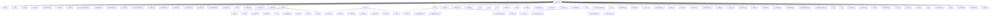

# Project Architecture

```mermaid
flowchart TD
    A["Project Root"]
    A --> N1["📁 .vscode"]
    A --> N2["📁 apps"]
    A --> N3["📁 assets"]
    A --> N4["📁 backend"]
    A --> N5["📁 documentation"]
    A --> N6["📁 frontend"]
    A --> N7["📁 shared"]
    A --> N8["📄 Pantry to Plate (1).html"]
    A --> N9["📄 README.md"]
    A --> N10["📄 architecture.md"]
    A --> N11["📄 auth.html"]
    A --> N12["📄 docker-compose.yml"]
    A --> N13["📄 index.html"]
    A --> N14["📄 manifest.json"]
    A --> N15["📄 nutribite.db"]
    A --> N16["📄 package.json"]
    A --> N17["📄 robots.txt"]
    A --> N18["📄 run_backend.py"]
    A --> N19["📄 sitemap.xml"]
    A --> N20["📄 sw.js"]
    A --> N21["📄 launch.json"]
    A --> N22["📄 settings.json"]
    A --> N23["📄 tasks.json"]
    A --> N24["📁 mobile"]
    A --> N25["📁 app"]
    A --> N26["📁 src"]
    A --> N27["📄 app.json"]
    A --> N28["📄 package.json"]
    A --> N29["📄 tsconfig.json"]
    N24 --> N30["📁 (tabs)"]
    N24 --> N31["📁 recipe"]
    N24 --> N32["📄 _layout.tsx"]
    N24 --> N33["📄 pricing.tsx"]
    N25 --> N34["📄 _layout.tsx"]
    N25 --> N35["📄 index.tsx"]
    N25 --> N36["📄 planner.tsx"]
    N25 --> N37["📄 profile.tsx"]
    N25 --> N38["📄 recipes.tsx"]
    N25 --> N39["📄 scan.tsx"]
    N25 --> N40["📄 [id].tsx"]
    N24 --> N41["📁 api"]
    N24 --> N42["📁 components"]
    N24 --> N43["📁 hooks"]
    N24 --> N44["📁 store"]
    N24 --> N45["📁 theme"]
    N26 --> N46["📄 client.ts"]
    N26 --> N47["📄 TabletSplitView.tsx"]
    N26 --> N48["📄 useDeviceLayout.ts"]
    N26 --> N49["📄 useNutriBiteStore.ts"]
    N26 --> N50["📄 colors.ts"]
    A --> N51["📁 css"]
    A --> N52["📁 img"]
    A --> N53["📁 js"]
    A --> N54["📄 style.css"]
    A --> N55["📄 app.js"]
    A --> N56["📄 auth.js"]
    A --> N57["📄 meal-planner.js"]
    A --> N58["📄 ml-model.js"]
    A --> N59["📄 tracker.js"]
    A --> N60["📄 voice-agent.js"]
    A --> N61["📁 app"]
    A --> N62["📁 generate_diagram.py"]
    A --> N63["📄 .env"]
    A --> N64["📄 .env.example"]
    A --> N65["📄 Dockerfile"]
    A --> N66["📄 __init__.py"]
    A --> N67["📄 init_postgres.py"]
    A --> N68["📄 main.py"]
    A --> N69["📄 meals.db"]
    A --> N70["📄 nutribite.db"]
    A --> N71["📄 requirements.txt"]
    A --> N72["📁 services"]
    A --> N73["📄 __init__.py"]
    A --> N74["📄 database.py"]
    A --> N75["📄 main.py"]
    A --> N76["📄 models.py"]
    A --> N77["📄 schemas.py"]
    A --> N78["📄 seed_data.py"]
    N61 --> N79["📄 __init__.py"]
    N61 --> N80["📄 assistant_service.py"]
    N61 --> N81["📄 nutrition_service.py"]
    N61 --> N82["📄 vision_service.py"]
    A --> N83["📄 generate_diagram.py"]
    A --> N84["📄 ARCHITECTURE.md"]
    A --> N85["📁 css"]
    A --> N86["📁 js"]
    A --> N87["📄 index.html"]
    A --> N88["📄 nutribite.css"]
    A --> N89["📄 app.js"]
    A --> N90["📄 components.js"]
    A --> N91["📄 data.js"]
    A --> N92["📄 router.js"]
    A --> N93["📄 state.js"]
    A --> N94["📁 api"]
    A --> N95["📁 design-system"]
    A --> N96["📁 types"]
    A --> N97["📄 contracts.ts"]
    A --> N98["📄 tokens.json"]
    A --> N99["📄 index.ts"]
```